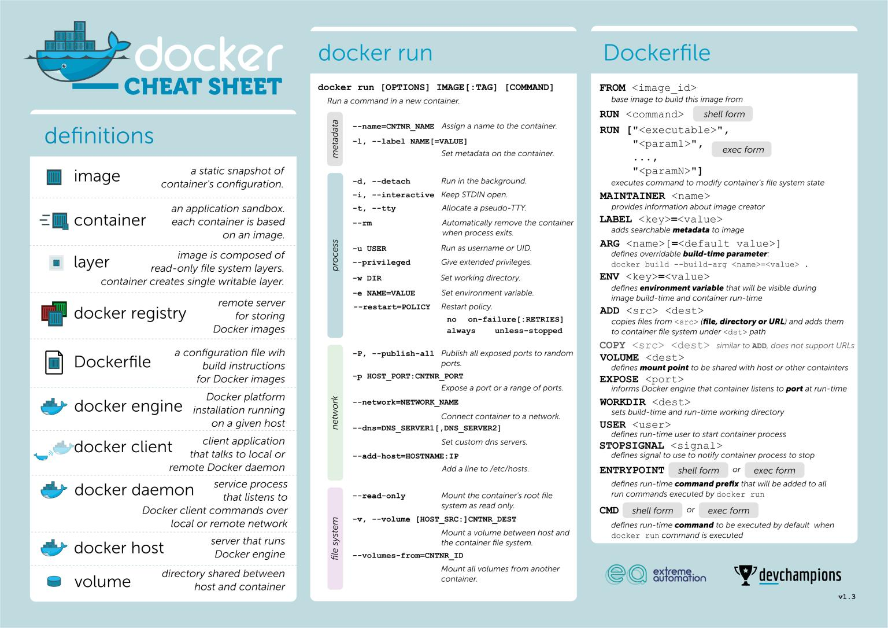

# EjemplosDocker

Ejemplos para presentación de Docker.



# limpia todas las instalaciones realizadas anteriormente

lista todas las imágenes en funcionamiento.

```sh
docker ps -a
```

Para y elimina todas instalaciones.

```sh
docker stop $(docker ps -a -q)
docker rm $(docker ps -a -q)
docker rmi $(docker images -a -q)
```

# 01-Docker

Ejemplo de creación de una imagen que incluye una sh.

# 02-Docker-MySQL

Ejemplo de servidor de DB MySql.

# 03-Docker-SFTP

Ejemplo de servidor SFTP.

# 04-Docker-ClienteServidor

Ejemplo de Cliente Servidor usando 2 docker que interactúan.

# 05-Docker-compose

Ejemplo de creación de unas imágenes con docker conpose.

# 06-Docket-compose-Jenkins

Ejemplo de creación de un servidor Jenkins con docker conpose.